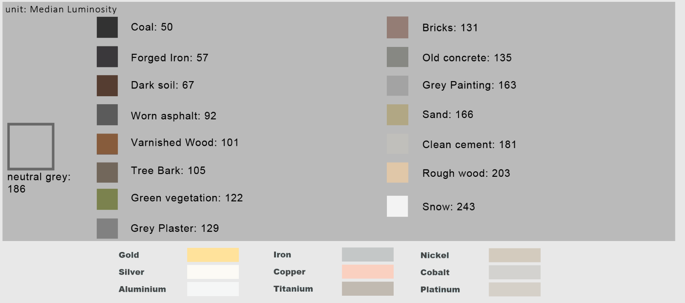
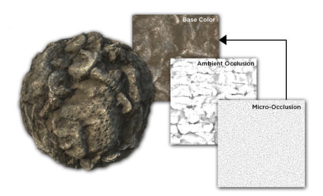
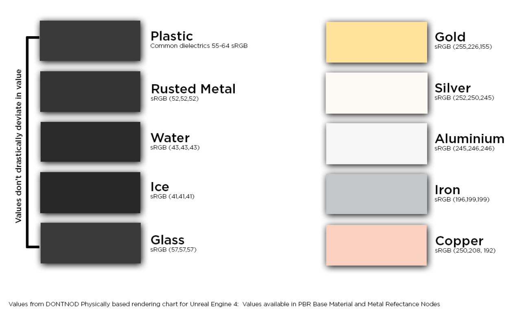
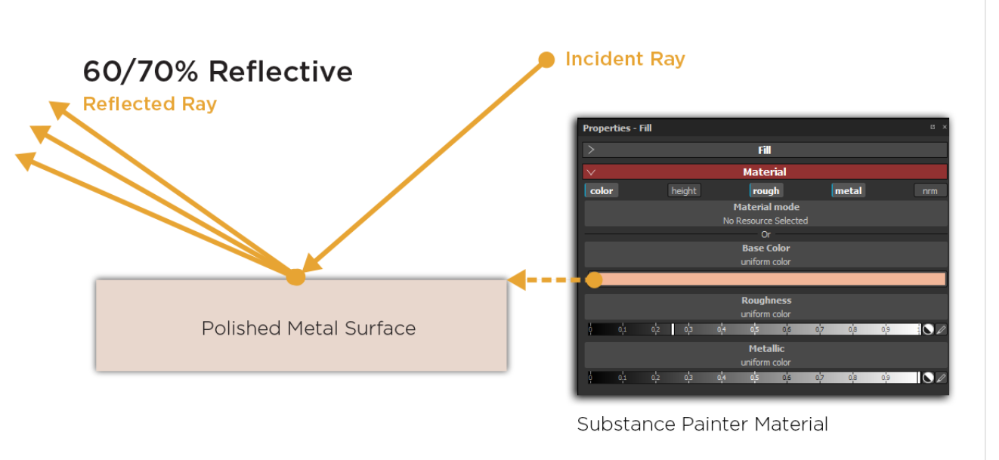
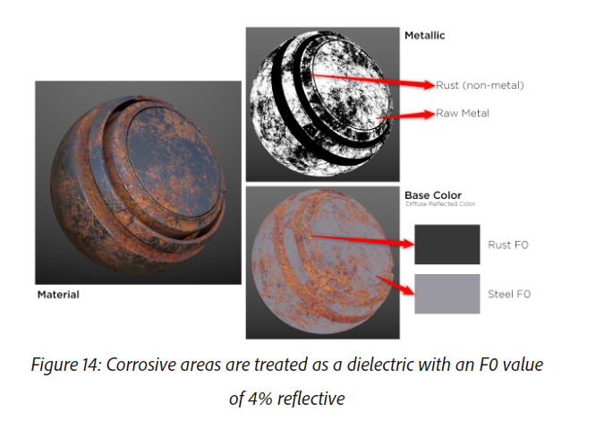
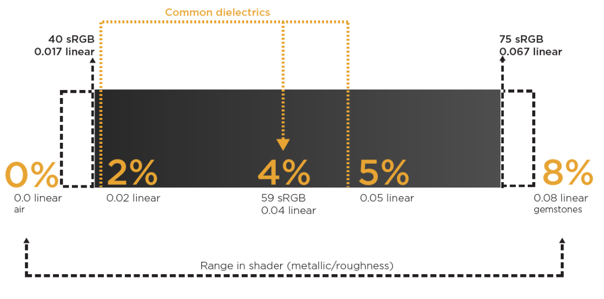
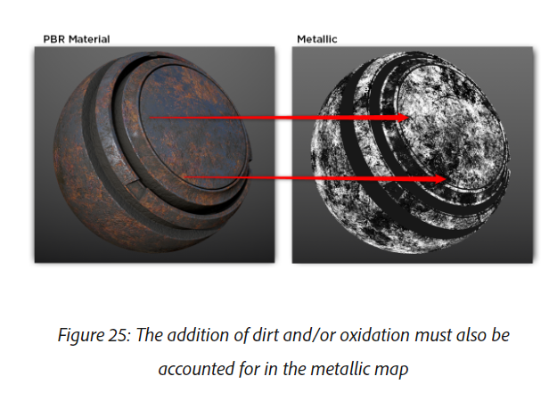
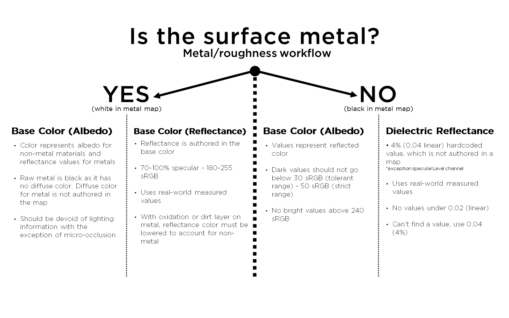

<!-- TOC -->

- [材质制作数值标准总结](#1.材质制作数值标准总结)
    - [材质参数范围](#1.1 材质参数范围)
        - [BaseColor（RGB-sRGB）](#1.1.1. basecolorrgb-srgb)
            - [Guidelines](#1.1.1.1. guidelines)
        - [Metallic](#1.1.2. metallic)
            - [F0(Fresnel Reflectance at 0 Degrees)](#1.1.2. f0fresnel-reflectance-at-0-degrees)
            - [金属](#1.1.2.2. 金属)
            - [非金属](#1.1.2.3. 非金属)
            - [Guideline](#1.1.2.4. guideline)
        - [Roughness](#1.1.3. roughness)
            - [GuideLine](#1.1.3.1. guideline)
        - [AO](#1.1.4. ao)
            - [Guidline](#1.1.4.1 guidline)
        - [总结](#1.1.5. 总结)
    - [Gamma空间](#1.2. gamma空间)
    - [验证](#1.3. 验证)

<!-- /TOC -->

# 1. 材质制作数值标准总结

## 1.1. 材质参数范围

### 1.1.1. BaseColor（RGB-sRGB）

在metal/roughness工作流中，非金属的反射颜色和金属的反射率（F0）保存在Abledo贴图中。

#### 1.1.1.1. Guidelines

1.  BaseColor是物体的固有色，没有色调的变化。所以对比度要比一般的DiffuseMap（画出光影的颜色贴图）低。

2.  物体的色调往往比印象中的浅，过暗的色调无法被照亮:安全的颜色范围： 50 - 240 sRGB 或者（50-243. ）。控制得当可以使用更广的范围:  30 - 240 sRGB。（最黑的是煤炭，最亮的是雪）下面是参考范围:

    

3.  BaseColor当中保存了非金属反射信息，所以不能包括光线本身的信息，比如：AO。但是可以添加微小的遮挡，但是当添加了微小遮挡之后，也必须在规定的亮度范围之内。

4.  金属的折射率(就是Color)应该从实际测量中获得，通常的范围是：**sRGB range of 180-255**.下面是一部分金属颜色：下图是一部分可以参考的颜色：

    

5.  如果金属出现了氧化和污渍不能被当做金属，尤其是当BaseColor当中加入了这种颜色，那么金属度也必须发生变化。

### 1.1.2. Metallic

通常用于区分金属与非金属。通常当做Mask使用,非金属的F0通常不是手动创建的，如果一个位置的金属度是0，会把这个位置的F0当做0.04处理。

#### 1.1.2.1. F0(Fresnel Reflectance at 0 Degrees)

1.  电介质(dielectrics)  :  0.02-0.05  如果不确定可以设置成0.04

2.  导体(conductors) :  0.5-1.0   

表面的反射率由折射率决定：

$$ F0 =( \frac{n-1}{n+1})^2 $$

非金属（电介质/绝缘体）应该是灰色值，金属（导体）应该是RGB值。对于光滑的表面电介质F0应该在 2%和5% of 之间,斜略角100%  他的F0变化不大。金属变化比较明显。

通常F0和导体和绝缘体相关，宝石是例外。

#### 1.1.2.2. 金属

我们通过折射率算出的折射光线是被吸收的光线。对于金属来说部分光线反射，折射光线直接被吸收。金属的颜色来自于折射的光线也就是F0,也就是说金属的F0就是金属的颜色。

虽然金属度为1通常是剖光金属，通常金属可以在 **235-255 sRGB** 之间，这个区间的材质反射率需要满足： 70-100%（Base ColorMap **180-255 sRGB** ）。

腐蚀金属在金属度贴图上是黑色，当做电介质处理。

涂漆金属被当做电介质。

污渍同样被当做非金属。

例子：

#### 1.1.2.3. 非金属

非金属没有导电性，折射的光线、被散射或者被吸收（大部分会再次从表面发散出去）所以被散射和被吸收后再次发射的光线构成了Albedo颜色。但是他的折射率很低比金属底，所以颜色更低贴图中的颜色要暗。

被反射的颜色为F0，为0.02-0.05.（ 0.017-0.067 (40-75 sRGB) ）宝石会大于0.4，这些值通常会被硬编码成固定的0.04。

大部分金属物体可以使用真是世界的测量值，但是，大部分不透明材质很难计算IOR，所以也很难的到F0。但是大部分电介质的F0变化不剧烈，所以SP给出了一些指导。

#### 1.1.2.4. Guideline

1.  腐蚀、氧化、污渍的金属不是金属,黑色的金属度，和灰色的非金属程度。
2.  金属度应该被当做一个Mask，用来告诉Shader如何解释Albedo贴图中的颜色信息。（金属：反射率，非金属：反射颜色）
3.  金属度不能总是0-1，在0-1之间应该有很窄的过渡灰。
4.  金属度为0.85-1（ **235-255 sRGB** ）的区域需要有高于70-100%（180-255 sRGB 或者 186-255）的反射率。
5.  如果金属度低于235 sRGB 那么需要降低对应BaseColor当中的颜色。降低程度可以根据氧化层、污渍层、腐蚀层的程度来决定。

### 1.1.3. Roughness

描述表面不规则情况，和光线的散射程度。粗糙=更大更黯淡的高光。

粗糙度用来描述同一种材质上的变化。磨损、折旧、风化、磨光。

粗糙度需要和法线贴图相关联。

#### 1.1.3.1. GuideLine

可以灵活的使用。

### 1.1.4. AO

描述环境光被遮挡。通常AO影响的是由环境贴图产生的环境光（amibient lighting）IBL。而不应该影响高光和直接光，所以不能放置在Albedo当中。尤其是对于金属，如果加到了Aldedo当中，对IBL和高光的影响会更加明显。

#### 1.1.4.1. Guidline

从高度图或者根据模型烘焙生成。

### 1.1.5. 总结

## 1.2. Gamma空间

需要被标记为Gamma的贴图：base color, diffuse, specular 和emissive. 

需要被标记为线性空间的： roughness, ambient occlusion, normal, metallic, and height.

 Usually .png, .jpg, .tga or .tif files are gamma-encoded while sRGB OETF and .exr files are linear.

## 1.3. 验证

SD:

*PBR Metal/Roughness Validate* ：

**Material Filters > PBR Utilities**. 可以进行材质金属度粗糙度的验证。The node outputs a heat map moving from red > yellow > green where red is incorrect and green/yellow is correct.

SP:

*PBR Metal/Roughness Validate (filter)* [下载链接](https://share.allegorithmic.com/libraries/824The)

