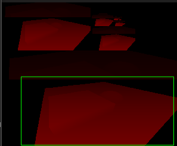

# HDRP深度纹理

```c
/**
Auther : LZ
Date   : 2018
Description
*/
```

## 引子

HDPR在内置纹理采样上使用了新的方式，网上并没有给出正确答案。并HDRP使用了HLSL语法和以往CG不同，所以资料很少。

这里主要讲解一下HDRP的内置深度纹理采样和相关的HLSL语法。

## DepthPyramid

HDRP的沿用了Legacy的_CameraDepthTexture之类的内置纹理名字，方便我们进行迁移，但是和原本采样方法产生了很大出入，下面详细解释。
	
 **为了支持新的渲染效果，HDRP生成了多分辨率版本的深度图（DepthPyramid）** 。即为Depth生成一个DepthPyramid。
	
这张DepthPayermid并不是类似mip的多分辨率版本纹理（类似通过lod参数对mip采样,如下*代码1*），而是**直接扩展了DepthBuffer的像素大小，把多个分辨率版本放在一张图中**。例如：原本Detph是1024 * 533，为了在DepthPayermid当中保存多个分辨率版本，需要把DepthPayermid扩展到 1024 * 1024。下图是完整的DepthPayermid，最下面的绿框就是真正的depthtexture。



```hlsl
tex2D（tex,float4(texcoord.xy,0,lod）；//代码1 ： 对mip采样
```

**HDRP的_CameraDepthTexture指的是DepthPyramid而非DepthTexture**  ，这样会需要一个很严重的问题。我们按照Legacy版本计算的 **屏幕纹理坐标[0,1] 对应的是整个DepthPyramid **。如何从DepthPyramid拿出最高层的Depth。
	
根据HDRP的Decal源代码和DepthPyramid生成代码可以发现两个地方。
	

1. DepthPyramid的最高层（DepthTexture）保存在左下角
	
2. DepthPyramid中最高层的分辨率和原本DepthTexture是一样的
	
	所以我们可以 ** 通过像素位置进行采样 ** 而不是纹理坐标，也就是说：Depth中[12,12]这个像素，刚好在DepthPyramid[12,12]这个位置上。
	
	HLSL语法为我们提供了这个采样函数，而CG是做不到的（当然也可以想办法计算一个比例）：

```C
tex.load(texcoord);	//代码2 ： 对使用像素位置采样
```

[Load的hlslAPI链接](https://docs.microsoft.com/en-us/windows/desktop/direct3dhlsl/t2d-load-float-int-uint-)

下面就是计算屏幕的像素位置（而不是纹理坐标），又刚好SV_POSITION语意，就是我们要的。
	
所以深度图的采样方式就是：

```c
_CameraDepthTexture.Load(sampler2D_CameraDepthTexture,positionSV);
//使用HDRP提供的宏就是：
LOAD_TEXTURE2D(_CameraDetphTexture, positionSV).x;
//其中positionSV就是的SV_POSITION对呀的值。
```

注：这种采样方式有个好处就是在Computeshader中可以很方便的和线程ID对应。整数计算效率更高。

## 关于HLSL语法

很多渲染语法是CG不支持的，其中有两点比较重要：

1. cg语法中sampler和texture无法分离，而一般GPU支持128个texture，只支持16个sampler，如果无法分离就导致我们只能最多用16个纹理。

2. 无法用整数采样器，就是上面的DepthPyramid的问题。

最重要的不同就是采样语法：

```c
//========cg==========
sampler2D tex1;
sampler2D tex2;
// 采样
tex2D(tex1,coord);
tex2D(tex2,coord);
//=========hlsl========
SamplerState sampler_tex;
Texture2D tex；
Texture2D tex1；
// 采样
tex.sample(sampler_tex,coord);
tex1.sample(sampler_tex,coord); //复用采样器
//
tex1.load(coord); // 直接读取像素

```

## 其他

关于深度金字塔似乎是一种叫做 Interleaved Sampling的技术。


